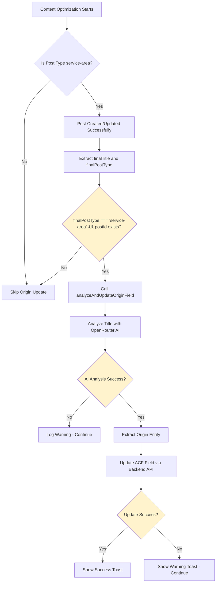

# ACF Origin Field Update Troubleshooting Handoff

## Overview

This feature automatically analyzes WordPress post titles and extracts the origin location entity (e.g., "Palm City, Florida") using OpenRouter AI, then updates the ACF Pro "Origin" field for service-area post types.

## Expected Behavior

When optimizing a service-area post with a title like:
- "Blinds, Shades & Shutters Near Palm City, Florida: Your Comprehensive Guide"

The system should:
1. Analyze the title using AI to extract the origin entity
2. Extract "Palm City, Florida" as the origin
3. Update the ACF "Origin" field with this value
4. Show a success toast notification: "Origin field updated: Palm City, Florida"

## Architecture Flow



## Code Location

### Frontend Files
- **AI Analysis Function**: [`src/lib/wordpress-acf-origin.ts`](src/lib/wordpress-acf-origin.ts)
  - `analyzeTitleForOrigin()` - Extracts origin from title using AI
  - `updateACFOriginField()` - Calls backend to update ACF field
  - `analyzeAndUpdateOriginField()` - Main function combining both steps

- **Integration Point**: [`src/lib/content-generation-upload.ts`](src/lib/content-generation-upload.ts)
  - Lines 391-422: Origin field update logic after post creation/update

### Backend Files
- **Backend Route**: [`server/wordpress-routes.js`](server/wordpress-routes.js)
  - Lines 2172-2350: `/update-acf-field` endpoint
  - Handles both ACF REST API and meta field update methods

## Debugging Checklist

### Step 1: Verify Post Type Detection

**Issue**: Origin update only runs for `service-area` post types. Check if the post type is being detected correctly.

**Debug Steps**:
1. Open browser DevTools Console
2. Look for log messages during content optimization:
   ```
   [Optimize Content] Creating new post after deletion: { postTypeEndpoint: '...', draftPostType: '...' }
   ```
3. Check if `postTypeEndpoint === 'service-area'` or `draftPostType === 'service-area'`
4. Verify `finalPostType` is set to `'service-area'` (line 185, 250, 310 in content-generation-upload.ts)

**Common Issues**:
- Post type is being detected as `'post'` instead of `'service-area'`
- `context.existingPost?.postTypeEndpoint` is not 'service-area'
- `context.resolved?.subtype` is not 'service-area'

**Fix**:
- Check WordPress REST API endpoint: `/wp-json/wp/v2/service-area/{id}`
- Verify post type in WordPress admin
- Check if custom post type is properly registered with REST API

### Step 2: Verify Function Execution

**Issue**: The origin update function is not being called at all.

**Debug Steps**:
1. Check console for log messages:
   ```
   [Content Generation] Successfully updated ACF Origin field...
   ```
   OR
   ```
   [Content Generation] Failed to update ACF Origin field...
   ```
   OR
   ```
   [Content Generation] Could not extract origin from title...
   ```

2. If NO log messages appear, the function is not being called:
   - Check if `finalPostType === 'service-area'` (line 394)
   - Check if `result.postId` exists (line 394)
   - Check if `finalTitle` is set (line 394)

**Fix**:
- Add breakpoint at line 394 in `content-generation-upload.ts`
- Verify all three conditions are met:
  ```typescript
  if (finalPostType === 'service-area' && result.postId && finalTitle) {
    // This should execute
  }
  ```

### Step 3: Verify AI Analysis

**Issue**: AI analysis fails or returns empty origin.

**Debug Steps**:
1. Check browser console for:
   ```
   [ACF Origin] Extracted origin "..." from title: "..."
   ```
   OR
   ```
   [ACF Origin] No origin entity extracted from title: "..."
   ```
   OR
   ```
   [ACF Origin] Error analyzing title: ...
   ```

2. Verify OpenRouter API key is set:
   - Check Settings → LLM Settings → OpenRouter API Key
   - Key should be present and valid

3. Test AI analysis manually:
   ```javascript
   // In browser console
   import { analyzeTitleForOrigin } from '@/lib/wordpress-acf-origin';
   const origin = await analyzeTitleForOrigin("Blinds, Shades & Shutters Near Palm City, Florida: Your Comprehensive Guide");
   console.log('Extracted origin:', origin);
   ```

**Common Issues**:
- OpenRouter API key not set or invalid
- API rate limit exceeded
- Title format not recognized by AI
- AI returns empty string or null

**Fix**:
- Set OpenRouter API key in settings
- Check OpenRouter API status/dashboard
- Test with different title formats
- Check AI response in network tab (OpenRouter API call)

### Step 4: Verify Backend API Call

**Issue**: Backend API call fails or returns error.

**Debug Steps**:
1. Check browser Network tab for:
   - Request: `POST /api/wordpress/update-acf-field`
   - Status code: 200 (success) or error code
   - Response body: JSON with `success: true/false` and `error` message

2. Check backend logs (terminal running backend server):
   ```
   [WordPress ACF] Updating field "origin" = "..." for post ID ...
   [WordPress ACF] Successfully updated field "origin" via ...
   ```
   OR
   ```
   [WordPress ACF] ACF REST API not available (404), trying meta field method
   [WordPress ACF] Meta key "origin" failed (400), trying next key
   ```

3. Test backend route manually:
   ```bash
   curl -X POST http://localhost:3001/api/wordpress/update-acf-field \
     -H "Content-Type: application/json" \
     -d '{
       "siteUrl": "intheshadeflorida.com",
       "username": "your-username",
       "appPassword": "your-app-password",
       "postId": 3838,
       "fieldName": "origin",
       "fieldValue": "Palm City, Florida",
       "postType": "service-area"
     }'
   ```

**Common Issues**:
- Backend server not running (localhost:3001)
- WordPress authentication failed (401)
- Post not found (404)
- ACF field name mismatch
- ACF REST API not enabled
- Meta field key incorrect

**Fix**:
- Start backend server: `npm run start:backend` or `node server/server.js`
- Verify WordPress credentials (username, application password)
- Check post ID exists and is correct
- Verify ACF field name is exactly "origin" (case-sensitive)
- Check if ACF REST API plugin is installed and enabled
- Verify ACF field is registered to REST API

### Step 5: Verify ACF Field Configuration

**Issue**: ACF field exists but update fails.

**Debug Steps**:
1. Check ACF field configuration in WordPress:
   - Field Name: Must be exactly `origin` (lowercase)
   - Field Type: Text, Textarea, or similar
   - Location Rules: Should include "Service Area" post type
   - REST API: Field should be registered to REST API (if using ACF REST API)

2. Test ACF REST API endpoint directly:
   ```bash
   curl -X GET "https://intheshadeflorida.com/wp-json/acf/v3/service-area/3838" \
     -u "username:app-password" \
     -H "Accept: application/json"
   ```
   
   Should return:
   ```json
   {
     "acf": {
       "origin": "current-value-or-empty"
     }
   }
   ```

3. Check WordPress meta field:
   ```bash
   curl -X GET "https://intheshadeflorida.com/wp-json/wp/v2/service-area/3838?context=edit" \
     -u "username:app-password" \
     -H "Accept: application/json"
   ```
   
   Look for `meta` object:
   ```json
   {
     "meta": {
       "origin": "...",
       "field_origin": "...",
       // or other ACF field key formats
     }
   }
   ```

**Common Issues**:
- ACF field name mismatch (e.g., "Origin" vs "origin")
- ACF field not registered to REST API
- ACF REST API plugin not installed
- Meta field key is different (e.g., `field_abc123` instead of `origin`)
- WordPress permissions issue (user doesn't have edit permission)

**Fix**:
- Rename ACF field to exactly `origin` (lowercase)
- Install and enable ACF REST API plugin (if using ACF REST API method)
- Check ACF field settings: Show in REST API = Yes
- Find correct meta field key from WordPress database or REST API response
- Update user role to Editor or Administrator
- Check if field is in correct field group attached to Service Area post type

### Step 6: Verify WordPress Permissions

**Issue**: Authentication or permission errors.

**Debug Steps**:
1. Check if WordPress Application Password is valid:
   ```bash
   curl -X GET "https://intheshadeflorida.com/wp-json/wp/v2/users/me" \
     -u "username:app-password" \
     -H "Accept: application/json"
   ```
   
   Should return user object, not 401 error

2. Check if user can edit service-area posts:
   - User role should be Editor or Administrator
   - Check WordPress capabilities

3. Check if ACF fields are editable via REST API:
   - User must have `edit_posts` capability for service-area post type
   - ACF field must allow REST API updates

**Common Issues**:
- Invalid application password
- User role insufficient (Subscriber, Contributor)
- ACF field is read-only in REST API
- WordPress REST API disabled

**Fix**:
- Generate new WordPress Application Password: Users → Profile → Application Passwords
- Change user role to Editor or Administrator
- Check ACF field settings for REST API permissions
- Enable WordPress REST API (should be enabled by default)

## Testing Procedure

### Manual Test Steps

1. **Setup**:
   - Ensure backend server is running on localhost:3001
   - Ensure WordPress site is connected in the app
   - Ensure OpenRouter API key is set
   - Have a service-area post ready (or create one)

2. **Test Title Analysis**:
   ```javascript
   // In browser console
   import { analyzeTitleForOrigin } from '@/lib/wordpress-acf-origin';
   
   const testTitles = [
     "Blinds, Shades & Shutters Near Palm City, Florida: Your Comprehensive Guide",
     "Best Plumber Services in Miami, FL",
     "Window Treatments Near Stuart, Florida",
     "HVAC Services for West Palm Beach, Florida"
   ];
   
   for (const title of testTitles) {
     const origin = await analyzeTitleForOrigin(title);
     console.log(`Title: "${title}"`);
     console.log(`Extracted Origin: "${origin}"`);
     console.log('---');
   }
   ```
   
   **Expected Results**:
   - "Palm City, Florida"
   - "Miami, FL"
   - "Stuart, Florida"
   - "West Palm Beach, Florida"

3. **Test Full Flow**:
   - Go to Content Optimization feature
   - Enter a service-area post URL
   - Optimize content
   - Watch console for log messages
   - Check if origin field is updated in WordPress admin
   - Check for success/error toast notifications

4. **Test Backend Route Directly**:
   ```bash
   # Replace with actual values
   POST http://localhost:3001/api/wordpress/update-acf-field
   {
     "siteUrl": "intheshadeflorida.com",
     "username": "your-username",
     "appPassword": "your-app-password",
     "postId": 3838,
     "fieldName": "origin",
     "fieldValue": "Palm City, Florida",
     "postType": "service-area"
   }
   ```
   
   **Expected Response**:
   ```json
   {
     "success": true,
     "method": "acf-rest-api" or "meta-field",
     "fieldName": "origin",
     "fieldValue": "Palm City, Florida",
     "metaKey": "origin" (if using meta-field method)
   }
   ```

## Common Error Messages and Solutions

### "Could not extract origin from title"
- **Cause**: AI analysis failed or returned empty string
- **Solution**: Check OpenRouter API key, verify title format, test AI analysis manually

### "Permission denied" (403)
- **Cause**: User doesn't have edit permission for ACF fields
- **Solution**: Change user role to Editor/Administrator, check ACF field permissions

### "Post not found" (404)
- **Cause**: Post ID is incorrect or post type endpoint is wrong
- **Solution**: Verify post ID exists, check post type is 'service-area', verify REST API endpoint

### "ACF REST API not available" (404)
- **Cause**: ACF REST API plugin not installed or endpoint doesn't exist
- **Solution**: This is OK - system will fall back to meta field method. Check if meta field method works.

### "Could not update ACF field" - All methods failed
- **Cause**: Field name incorrect or ACF field not properly configured
- **Solution**: Verify ACF field name is exactly "origin", check field is attached to Service Area post type, verify meta field key format

### "Cannot connect to backend server"
- **Cause**: Backend server not running
- **Solution**: Start backend server: `npm run start:backend` or check server logs

### No error but field not updated
- **Cause**: Silent failure or wrong post type detected
- **Solution**: 
  1. Check console logs for `[Content Generation]` messages
  2. Verify `finalPostType === 'service-area'` condition
  3. Check if function is even being called (add console.log)
  4. Verify post is actually service-area type in WordPress

## Debugging Commands

### Check if Origin Update Code Executes
Add temporary logging in `content-generation-upload.ts` at line 394:
```typescript
console.log('[DEBUG] Origin Update Check:', {
  finalPostType,
  resultPostId: result.postId,
  finalTitle,
  willExecute: finalPostType === 'service-area' && result.postId && finalTitle
});
```

### Check ACF Field Name in WordPress
```sql
-- In WordPress database
SELECT meta_key, meta_value 
FROM wp_postmeta 
WHERE post_id = 3838 
AND (meta_key LIKE '%origin%' OR meta_key LIKE '%field_%');
```

### Check WordPress REST API Response
```bash
# Get post with ACF fields (if ACF REST API enabled)
curl "https://intheshadeflorida.com/wp-json/acf/v3/service-area/3838" \
  -u "username:app-password"

# Get post meta
curl "https://intheshadeflorida.com/wp-json/wp/v2/service-area/3838?context=edit" \
  -u "username:app-password"
```

## Next Steps if Still Not Working

1. **Enable Detailed Logging**:
   - Add more console.log statements in `wordpress-acf-origin.ts`
   - Check backend logs for detailed error messages
   - Enable WordPress REST API logging (if available)

2. **Test Each Component Separately**:
   - Test AI analysis function alone
   - Test backend route alone
   - Test ACF field update manually in WordPress
   - Test REST API endpoints directly

3. **Check WordPress Configuration**:
   - Verify ACF Pro is installed and active
   - Verify Service Area custom post type exists
   - Verify ACF field group is attached to Service Area post type
   - Check ACF field settings (name, type, REST API registration)

4. **Alternative Approaches**:
   - Try using ACF field key instead of field name
   - Try updating via WordPress REST API meta endpoint directly
   - Consider using ACF REST API plugin if not already installed
   - Check if field needs to be in a specific format (e.g., array for repeater fields)

## Files to Check/Modify

### Primary Files
- [`src/lib/wordpress-acf-origin.ts`](src/lib/wordpress-acf-origin.ts) - AI analysis and update functions
- [`src/lib/content-generation-upload.ts`](src/lib/content-generation-upload.ts) - Integration point (lines 391-422)
- [`server/wordpress-routes.js`](server/wordpress-routes.js) - Backend route (lines 2172-2350)

### Supporting Files
- [`src/lib/api.ts`](src/lib/api.ts) - OpenRouter API key loading
- [`src/lib/wordpress-api.ts`](src/lib/wordpress-api.ts) - WordPress API utilities

## Known Limitations

1. **Only works for service-area post types** - Other post types are skipped
2. **Requires OpenRouter API key** - Will fail if key is missing
3. **ACF field must be named exactly "origin"** - Case-sensitive
4. **Requires ACF Pro or ACF REST API plugin** - For REST API method (meta field method is fallback)
5. **Non-blocking** - Errors don't stop content optimization process
6. **Silent failures possible** - Some errors may only show in console logs

## Contact Points

If issue persists after following this troubleshooting guide:
1. Check browser console for detailed error messages
2. Check backend server logs for API errors
3. Test each component individually (AI analysis, backend route, ACF field)
4. Verify WordPress ACF configuration matches expected format
5. Check if this is a one-time issue or happens consistently

