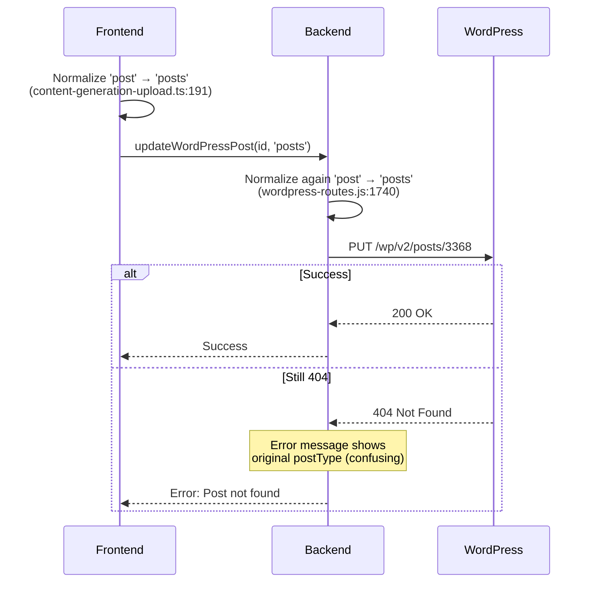

# Post Not Found Error - Updated Handoff Sheet

## Issue Summary

**Error Message:** `Post not found (ID: 3368, Type: post). Please verify the post ID and type.`

**Affected URL:** `https://intheshadeflorida.com/blog/what-happens-at-a-window-treatment-consultation`

**Post Type:** Regular WordPress post (not a custom post type)

**Status:** Error persists after initial fix attempts

## Root Cause Analysis - UPDATED

### The REAL Problem (CRITICAL FINDING)

**The issue is NOT the endpoint normalization** - that's already fixed. The real problem is:

**WordPress Search API returns wrong IDs for standard posts**

The resolver uses Search API as a fallback (line 1275-1307 in `server/wordpress-routes.js`), and for blog posts, WordPress Search API can return:
- ❌ A **revision** (not the canonical post)
- ❌ A **trashed post**
- ❌ A **different post with same slug**
- ❌ An **auto-draft**
- ❌ A **post in another language** (Polylang/WPML)

**Why CPTs work but posts fail:**
- CPTs have fewer objects, no revisions exposed, cleaner slug namespace
- Posts have revisions, autosaves, trash - Search API is non-deterministic

**Current Flow (PROBLEMATIC):**
1. Resolver tries slug-based lookup first (✅ correct)
2. If slug lookup fails, falls back to Search API (❌ returns wrong ID for posts)
3. Search API returns ID 3368 (might be revision/trash)
4. Update fails because ID 3368 doesn't exist in `/wp/v2/posts/` endpoint

### The Problem (Original Analysis - Partially Correct)

When updating a WordPress post, the system may still be using the wrong REST API endpoint. WordPress REST API requires plural endpoint names:
- ✅ Correct: `/wp-json/wp/v2/posts/3368`
- ❌ Wrong: `/wp-json/wp/v2/post/3368`

### Current Implementation Status

**Fixes Applied:**
1. ✅ Backend update endpoint normalization (`server/wordpress-routes.js:1740`)
2. ✅ Frontend update path normalization (`src/lib/content-generation-upload.ts:191-193`)
3. ✅ Frontend draft creation normalization (`src/lib/content-generation-upload.ts:221-223`)

**However, error still occurs**, which suggests:

### Root Cause: Search API Fallback Returns Wrong ID

**Location:** `server/wordpress-routes.js:1275-1307`

The resolver has this flow:
1. ✅ **Primary:** Slug-based lookup (`/wp/v2/posts?slug=...`) - CORRECT
2. ❌ **Fallback:** Search API (`/wp/v2/search?search=...&type=post`) - PROBLEMATIC

**The Search API fallback is the culprit:**
- Line 1281: Uses `/wp-json/wp/v2/search?search={slug}&type=post`
- Line 1285-1301: Takes first result or "best match"
- **Problem:** Search API can return revisions, trashed posts, auto-drafts
- **Result:** Wrong ID gets returned, update fails with 404

**Why this only affects posts:**
- Posts have revisions, autosaves, trash entries
- CPTs have cleaner namespace, fewer objects
- Search API is non-deterministic for posts

### Additional Potential Issues

1. **Backend Server Not Restarted**
   - Node.js backend must be restarted for changes to take effect
   - Changes to `server/wordpress-routes.js` require server restart

2. **Error Message Confusion**
   - Error message shows original `postType` value (line 1820)
   - Actual API call uses normalized `endpointName` (line 1741)
   - Error message may be misleading - check actual API URL in logs

## Debugging Steps (CRITICAL)

### Step 1: Verify Backend Server Restart

```bash
# Check if backend is running
# Restart the backend server to ensure changes are loaded
# Location: server/wordpress-routes.js changes require restart
```

### Step 2: Check Backend Console Logs

Look for this log message when updating:
```
[WordPress] Updating post 3368 (type: post, endpoint: posts) at: https://...
```

**What to check:**
- Does the log show `endpoint: posts`? (Should be normalized)
- What is the actual API URL being called?
- Is it `/wp/v2/posts/3368` or `/wp/v2/post/3368`?

### Step 3: Check Frontend Console Logs

Look for this log message:
```
[Optimize Content] Updating post: { id: 3368, postTypeEndpoint: '...', ... }
```

**What to check:**
- What is the `postTypeEndpoint` value?
- What is the `resolvedSubtype` value?
- What is the `existingPostEndpoint` value?

### Step 4: Verify Post Actually Exists

Test the WordPress REST API directly:

```bash
# Should work - test with correct endpoint
curl -X GET "https://intheshadeflorida.com/wp-json/wp/v2/posts/3368" \
  -u "username:app_password"

# Should fail - test with wrong endpoint
curl -X GET "https://intheshadeflorida.com/wp-json/wp/v2/post/3368" \
  -u "username:app_password"
```

### Step 5: Check Network Tab

In browser DevTools → Network tab:
1. Filter for requests to `/api/wordpress/update-post`
2. Check the request payload
3. What is the `postType` value in the request body?

### Step 6: Add Enhanced Logging

Add this temporary logging in `server/wordpress-routes.js` around line 1721:

```javascript
console.log('[WordPress] Update request received:', {
  postId: postId,
  postType: postType,
  endpointName: endpointName, // After normalization
  apiUrl: apiUrl
});
```

## Code Flow Analysis



## Additional Investigation Needed

### Check 1: Is the Post ID Correct?

The post ID 3368 might be:
- Wrong ID (post doesn't exist)
- Belongs to a different post type
- Was deleted or moved

**Verify:**
```bash
# Get all posts and search for the URL
curl "https://intheshadeflorida.com/wp-json/wp/v2/posts?search=window-treatment-consultation"
```

### Check 2: Is There a Permissions Issue?

Even with correct endpoint, 404 can mean:
- User doesn't have permission to update this post
- Post exists but is in a different status
- Post is in trash

### Check 3: Is the Backend Code Actually Updated?

Verify the fix is in the file:

```bash
# Check line 1740 in server/wordpress-routes.js
grep -n "endpointName = postType" server/wordpress-routes.js
```

Should show:
```javascript
const endpointName = postType === 'post' ? 'posts' : postType;
```

## Recommended Solution (CRITICAL)

### Fix: Remove Search API Fallback for Posts

**Never use `/wp/v2/search` for post resolution** - it's non-deterministic.

**Replace Search API fallback with:**
1. Enhanced slug-based lookup with `context=edit`
2. Direct ID verification before returning
3. Hard assertion that canonical post exists

### Implementation Plan

1. **Remove Search API Fallback for Posts** (`server/wordpress-routes.js:1275-1307`)
   - Keep slug-based resolution (already correct)
   - Remove or restrict Search API fallback to CPTs only
   - For posts, fail gracefully if slug lookup fails

2. **Add Slug Lookup with Edit Context**
   - Use `/wp/v2/posts?slug={slug}&context=edit`
   - This ensures we get the editable post, not revisions

3. **Add ID Verification**
   - After resolution, verify the ID exists via direct GET
   - Assert: `GET /wp/v2/posts/{id}` returns 200
   - If not, log warning and try alternative resolution

4. **Enhanced Logging**
   - Log which resolution method succeeded
   - Log the resolved ID and verify it's canonical
   - Log if Search API was used (should be rare/never for posts)

## Recommended Next Steps

1. **Immediate: Remove Search API Fallback for Posts**
   - Comment out or remove lines 1275-1307 in `server/wordpress-routes.js`
   - Or restrict Search API to CPTs only (not 'post' type)

2. **Add Enhanced Slug Lookup**
   - Use `context=edit` parameter for slug-based resolution
   - This ensures we get the canonical post

3. **Add ID Verification Step**
   - After resolution, verify ID exists via direct GET
   - Log warning if ID doesn't match canonical post

4. **Test with Direct API Call**
   - Verify the post exists at the resolved ID
   - Test: `GET /wp/v2/posts/3368` should return 200
   - If 404, the ID is wrong (likely from Search API)

5. **Add Debug Logging**
   - Log which resolution method was used
   - Log the resolved ID and verify it's canonical
   - Log if Search API returned multiple results (red flag)

## Files to Review

- `server/wordpress-routes.js` (lines 1737-1743, 1817-1821)
- `src/lib/content-generation-upload.ts` (lines 184-208)
- `src/lib/wordpress-api.ts` (lines 778-791)
- `src/hooks/use-content-optimization.ts` (lines 138-141)

## Error Message Improvement

**Current (line 1820):**
```javascript
error: `Post not found (ID: ${postId}, Type: ${postType}). Please verify the post ID and type.`
```

**Recommended:**
```javascript
error: `Post not found (ID: ${postId}, Type: ${postType}, Endpoint: ${endpointName}). Please verify the post ID and type. API URL: ${apiUrl}`
```

This will show:
- Original type from request
- Normalized endpoint actually used
- Full API URL that was called

## Testing Checklist

- [ ] Backend server restarted after code changes
- [ ] Backend logs show normalized endpoint ('posts' not 'post')
- [ ] Frontend logs show postTypeEndpoint value
- [ ] Network tab shows correct postType in request
- [ ] Direct API test confirms post exists at /wp/v2/posts/3368
- [ ] Error message updated to show endpointName
- [ ] Enhanced logging added and reviewed

## Critical Questions to Answer

1. **Was Search API used for resolution?** (Check logs for "Resolved via Search API fallback")
2. **Does the resolved ID actually exist?** (Test: `GET /wp/v2/posts/3368`)
3. **Is ID 3368 a revision or trashed post?** (Search API can return these)
4. **What does slug-based lookup return?** (Should be primary method)
5. **Has the backend server been restarted?** (Required for any changes)

## Quick Diagnostic Test

Run this to see if Search API returns wrong results:

```bash
# This might return multiple results (revisions, trash, etc.)
curl "https://intheshadeflorida.com/wp-json/wp/v2/search?search=what-happens-at-a-window-treatment-consultation&type=post"

# This should return exactly one result (canonical post)
curl "https://intheshadeflorida.com/wp-json/wp/v2/posts?slug=what-happens-at-a-window-treatment-consultation&context=edit"
```

**If Search API returns multiple results or wrong ID, that's the problem.**

## Additional Notes

- The normalization code is in place but may not be executing
- The error message is misleading (shows original type, not normalized)
- Backend server restart is required for changes to take effect
- Need to verify the actual API URL being called, not just the error message

